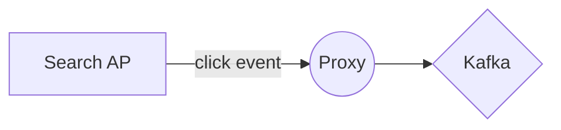

# Kafka Proxy

由於使用kafka需用相關library，但單純用Producer方面，只需要能拋event給kafka即可，；另一方面在DMZ區的server要接內網kafka的一個個server開通，因此在DMZ放此程式，只需開通此Server。

# Install

## build
```
$ gilde up
$ go build proxy.go
```

## Run proxy
``
./proxy -port=8000 -kafka=""172.17.35.199:9092"
``

### Usage of ./proxy:
 - kafka string
Kafka ip (default "172.17.35.199:9092")
 - port int
Proxy hosting port (default 8000)
  
## Create request

-example
curl -H "Content-Type: application/json" -X POST -d '{"Topic":"Search","Message":"xyz"}' localhost:8000/goKafka
 
## Parameter
 
POST Body with json {"Topic":"Search","Message":"xyz"}
 
> **Note:**  目前只有檢查是否有丟參數

   
# UML diagrams


flow chart:



